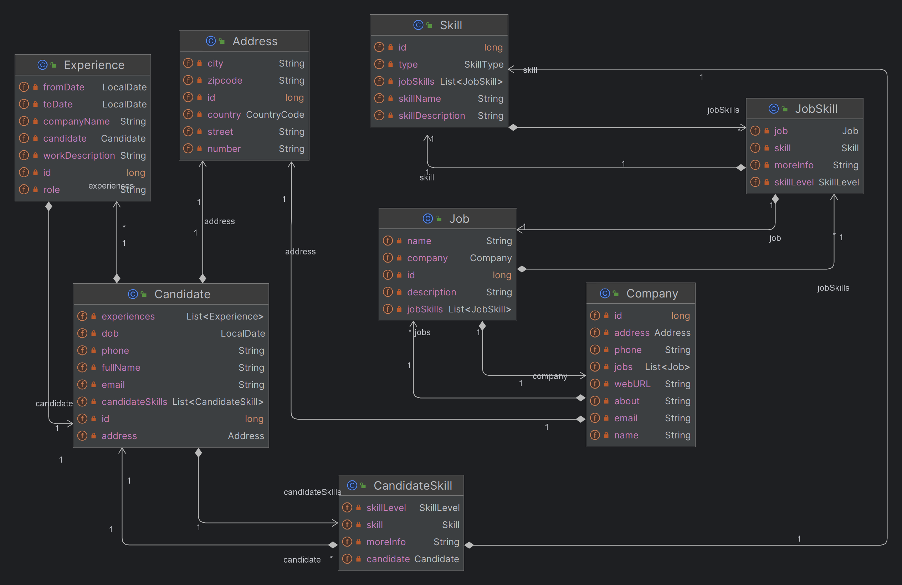
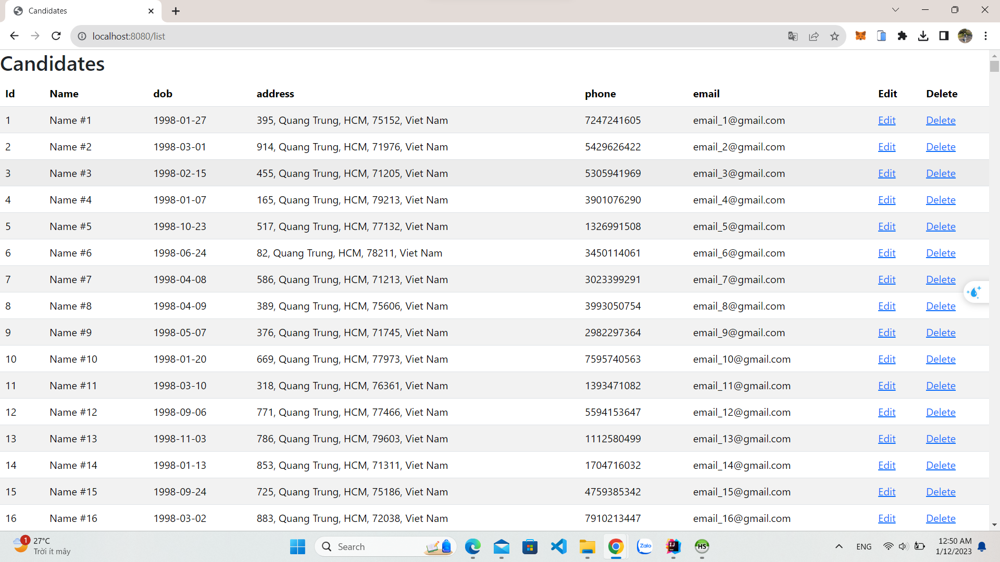
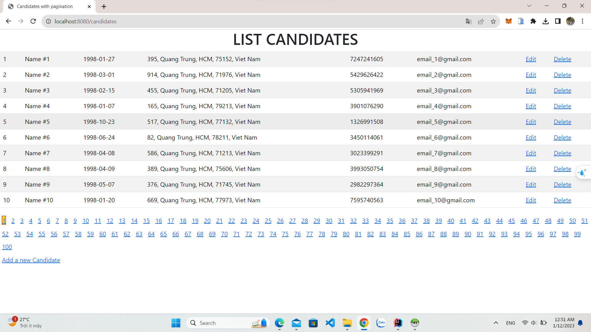
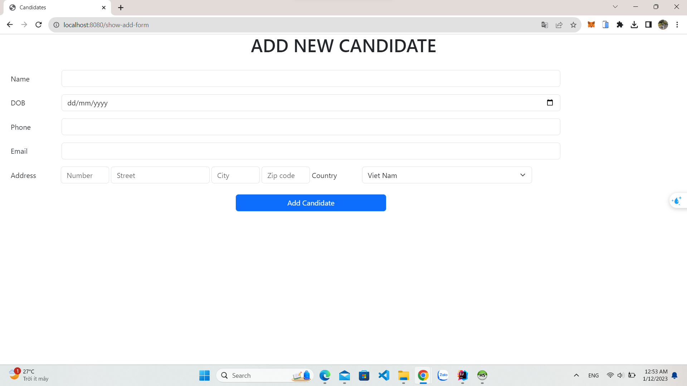
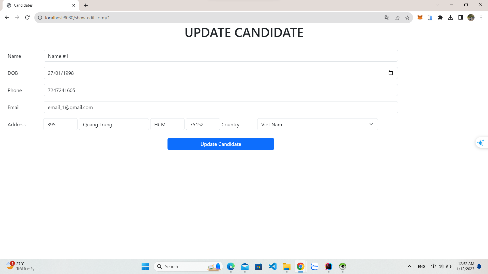

# www-lab-week05
### Ứng dụng web tuyển dụng sử dụng Spring Boot
Ứng dụng web này cho phép các công ty đăng tin tuyển dụng và ứng viên ứng tuyển. Ứng dụng sử dụng Spring Boot để phát triển.
## Class Diagram

## Chưa Phân Trang

## Đã Phân Trang

## Trang thêm candidate

## Trang update candidate

## Back End
- Ánh xạ các entity, `repository` extends `JpaRepository`.  
- `Spring Boot - REST API`.   
## Front End
- `Spring MVC`.  
  -  Candidate page  
  -  Candidate add  
  -  Candidate delete  
  -  Candidate update   
 

